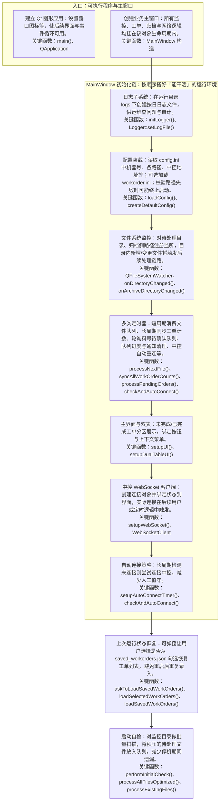
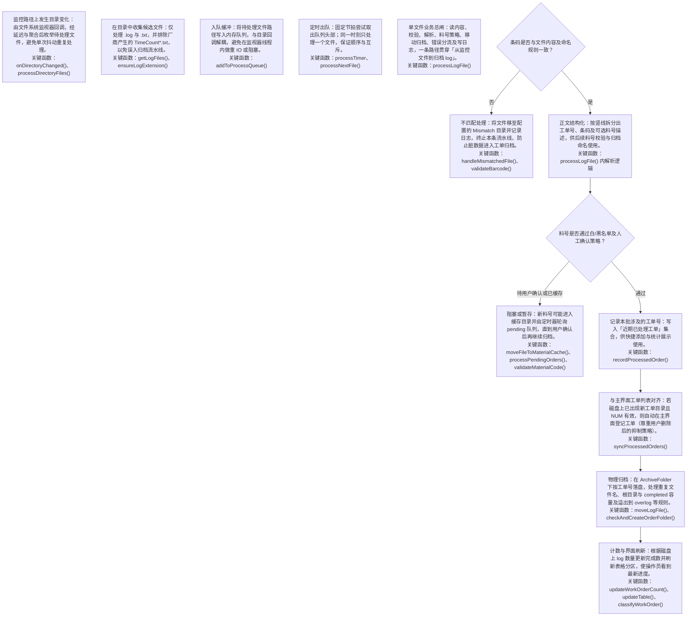
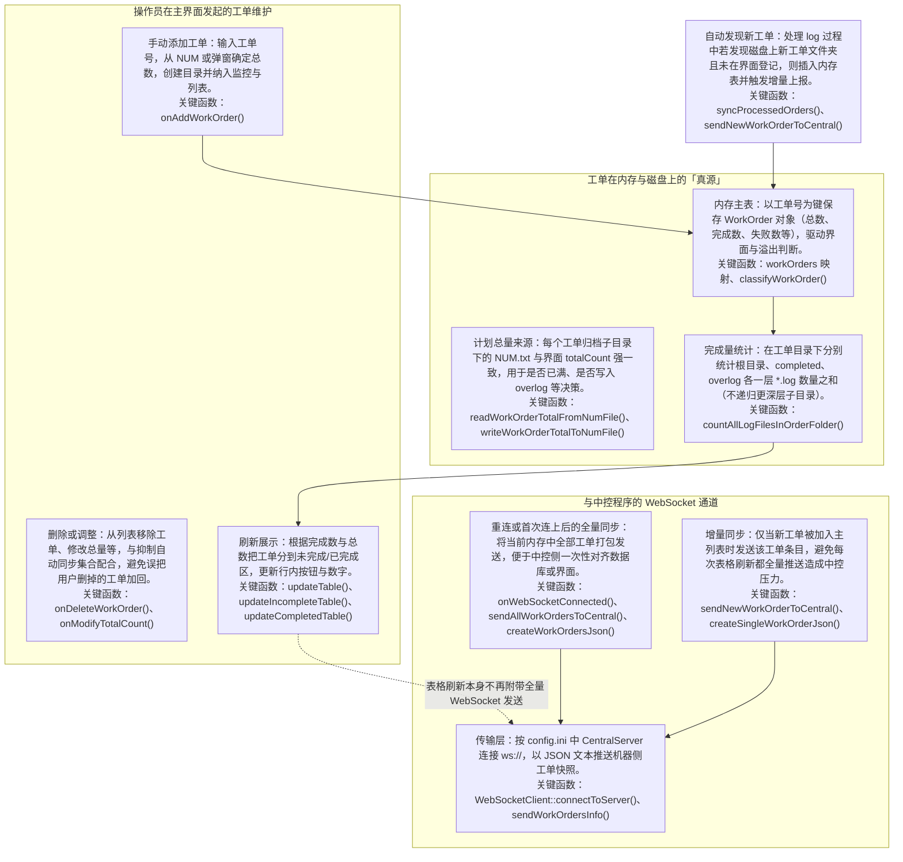
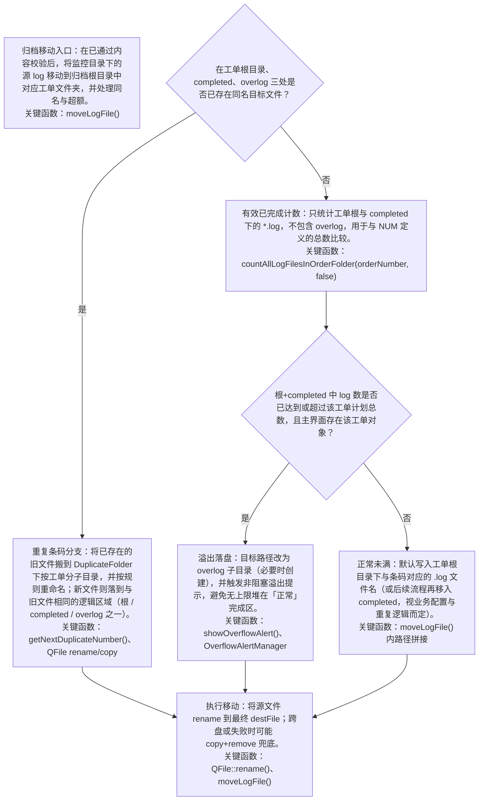
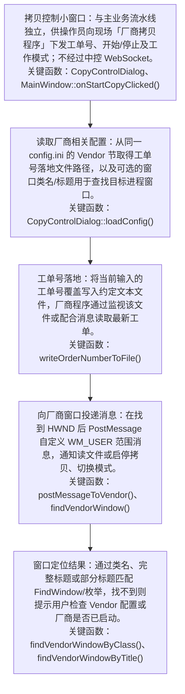

# copyssd 程序交接手册

> 基于当前仓库代码整理，供后续维护与二次开发交接使用。  
> 说明：本程序为 **拷贝机侧** 工单管理客户端，通过 **WebSocket 客户端** 连接中控（CenterControl）；与中控手册中的「服务端」角色相反。归档与计数以 `Path/ArchiveFolder` 为准；计划总数以 `Path/WorkordersRoot` 下 `NUM.txt` 为准（见 **§2.2**、**§2.3**）。

---

## 一、程序定位与运行形态

本章说明程序在产线上的角色、启动顺序与运行时文件，帮助接手人先建立「数据从哪来、落到哪、谁在对账」的整体图景。各路径含义与配置键见 **第二章**；带条件的业务行为见 **第四章**；端到端流程见 **第五章** Mermaid 图。

### 1.1 系统角色

**这块在做什么**

copyssd 不是拷贝程序本身，而是部署在 **单台拷贝机工位** 上的 **工单与 log 治理客户端**：把厂商程序写出来的零散 log，校验后归入按工单划分的归档树，并在界面上维护「计划片数 vs 已完成片数」，同时可选把进度推送给中控大屏。它与拷贝程序、中控、厂商窗口是三条相对独立的集成线，不要混为一谈。

**主要职责**

| 职责 | 说明 | 详见 |
|------|------|------|
| 待处理接入 | 监控 `WatchFolder` 下新 log/txt，串行校验后归档 | §2.2、§4.3 |
| 归档与计数 | 按工单目录统计 log，区分正常区、completed、overlog | §4.2、§4.4 |
| 界面双表 | 未完成 / 已完成分区展示，操作员可手动加删改单 | §4.1 |
| 中控上报 | WebSocket **客户端**，JSON 推送工单进度 | §2.6、§4.8 |
| 厂商控制（可选） | 写工单号文件 + `PostMessage`，与中控无关 | §2.7、§4.9 |

**产线数据流（简图）**

```
厂商拷贝程序 ──写 log/txt──→ WatchFolder（待处理，尚未归属工单归档）
         │
         ▼
    copyssd 校验条码/料号
         │
         ├── 错码/坏格式 ──→ Mismatch / Error 等分流目录
         └── 通过 ──→ ArchiveFolder/<工单>/（根 | completed | overlog）
         
计划片数（总数）── 只读/写 ──→ WorkordersRoot/<工单>/NUM.txt
界面与中控 JSON 的 totalCount ── 以 NUM 为准（非 Archive 下）

copyssd ──WS 客户端──→ 中控 CenterControl（连上全量 + 新工单增量）
copyssd ──可选──→ 厂商窗口（Vendor 配置，PostMessage）
```

**与现场其它程序的分工**：拷贝程序只负责「写出片 log」；copyssd 负责「认单、归档、计数、上报」；中控负责「多机汇总展示」；三者配置路径必须在现场文档中写清楚，避免 NUM 与 log 根目录搞混。

### 1.2 技术栈与构建

**这块在做什么**

说明如何从源码得到可部署的 exe，以及工程里哪些文件是主线、哪些可忽略。

| 项目 | 说明 |
|------|------|
| 工程名 | `copyssd`（根目录 `CMakeLists.txt` + Qt 5/6） |
| 入口 | `main.cpp`：创建 `QApplication` → `MainWindow` → `exec()` |
| 核心业务 | `mainwindow.cpp` / `mainwindow.h`（体量最大，改需求优先打开） |
| UI 布局 | `mainwindow.ui`（Qt Designer），逻辑在 cpp 槽函数 |
| 依赖模块 | `Qt5::Widgets`、`Qt5::WebSockets`、`Qt5::Concurrent`（大小校验异步） |
| 资源 | `resources.qrc`（图标等） |
| 未纳入构建 | `MessageControl*.cpp`（MFC 示例）、各类 `*.md` 设计笔记 |

**构建提示**：需在 PATH 中配置好 Qt 与 CMake；Release 部署时连同 Qt 运行库、`config.ini` 样例一并打包。工作目录必须为 exe 所在目录（或启动脚本 `cd` 到该目录），否则读不到 `config.ini` 与 `logs/`。

### 1.3 工作目录与运行时文件

**这块在做什么**

程序默认以 **进程当前工作目录** 为「应用根」：配置、日志、可选恢复 JSON 都相对此目录。网络盘上的 Watch/Archive/NUM 路径则在 `config.ini` 里配置，与 exe 目录可以不在同一盘符。

| 路径/文件 | 说明 | 谁创建/谁维护 | 详见 |
|-----------|------|----------------|------|
| `config.ini` | 主配置，启动必读 | 现场维护；缺省由程序生成 | 第二章 |
| `logs/app_yyyy-MM-dd.log` | 运行日志，按日文件 | `initLogger()` | §7 |
| `saved_workorders.json` | 上次退出前保存的工单列表快照 | 程序可选写、启动可选读 | §4.10 |
| `netuse.bat` | 映射网络盘（若使用 UNC） | 现场维护，与 exe 同目录 | §1.4 步骤 1 |
| `ArchiveFolder/<工单>/` | 已归档 log、料号 JSON、`TimeCount*` | 程序写入为主 | §4.2 |
| `WorkordersRoot/<工单>/NUM.txt` | **计划总数（片数）** | 程序或 MES/人工维护 | §2.3 |

**注意**：不要把 `NUM.txt` 建在 `ArchiveFolder` 下——代码只认 `WorkordersRoot` 路径（见 **§2.3**、§4.2）。

### 1.4 启动顺序

**这块在做什么**

`MainWindow` 构造函数按固定顺序初始化子系统；理解顺序有助于排查「一启动就退出」「监控未生效」等问题。下列步骤在 UI 显示前完成关键配置与定时器注册，100 ms 后的恢复/自检则避免阻塞窗口首次绘制。

| 步骤 | 动作 | 目的 | 失败时表现 |
|------|------|------|------------|
| 1 | 可选执行 `netuse.bat` | 先映射网络盘再验路径 | 失败仅 warning，继续启动 |
| 2 | `initLogger()` | 建立 `logs/` 与当日日志文件 | 目录不可写时影响排障 |
| 3 | `loadConfig()` | 读 ini、校验路径、填充成员变量 | 关键路径失败 → 弹窗 → **退出** |
| 4 | 创建 `processTimer`、`syncTimer` 等 + `fileWatcher` | 队列消费、周期同步、目录监控 | 见 **§2.9** |
| 5 | `setupUI` / `setupWebSocket` / `setupAutoConnectTimer` | 界面与中控客户端、10 min 自动重连 | WS 未连上不影响本地归档 |
| 6 | 延迟 100 ms：`askToLoadSavedWorkOrders` → `performInitialCheck` | 可选恢复工单 + 扫 Watch 积压 | 用户拒绝恢复则跳过 JSON |
| 7 | `addPath(watchPath)`；约 1 s 后 `setupWorkOrderMonitoring` | 监控待处理目录；为已登记工单挂归档子目录监控 | Watch 不存在则无监控 |

**延伸阅读**：配置项与定时器间隔见 **§2.1**、**§2.9**；启动后文件处理见 **§5.1**。

### 1.5 与中控的关系

**这块在做什么**

copyssd 与 CenterControl 通过 **同一 WebSocket 端口** 通信，但角色与发送策略与中控手册中的描述成对出现：本机永远是 **发起连接的一方**，不负责监听端口。

| 项目 | copyssd（本程序） | CenterControl（中控） |
|------|-------------------|------------------------|
| WebSocket 角色 | **客户端** `ws://IP:Port` | **服务端** 监听 `Port` |
| 报文格式 | 纯 JSON 文本，无外层 msgType | 解析 `machineId` + `orders[]` |
| 发送策略 | 连接成功 **全量**；新工单入表 **单条增量**；`updateTable` **不**全量 | 登记/刷新界面（见中控手册 **§2.6**） |
| 断线重连 | 清空「本连接已发送集合」→ 重连后再全量 | 视中控实现而定 |

**现场联调建议**：先确认单机 `CentralServer` IP/Port 能连上，再验证「手动加一单 → 中控出现一条」；避免使用仍会每次刷新全量推送的旧版 copyssd，以免中控 log 刷屏（见 **§4.11**）。

---

## 二、`config.ini` 与代码对应关系

本章按 **配置节** 说明。每一节结构为：**先用文字说明该配置对应模块要做什么（主要任务与协作关系）**，**再列配置项、默认值与条件规则**；若细节已在它处展开，用 **「见 §x.x」** 引用。现场样例见 `config_example.ini`；缺省文件由 `createDefaultConfig()` 生成。

### 2.1 配置加载总则

**这块在做什么**

`config.ini` 是整个程序的「开关与路径总表」。启动时从**当前工作目录**读取（`QSettings("config.ini")`），将机器号、各路径、校验周期等载入 `MainWindow` 成员变量；此后监控、归档、计数、WebSocket 发送均依赖这些变量，**运行中不会热重载**（改 ini 需重启）。

**对应模块**

- **主加载**：`MainWindow::loadConfig()`（构造时、UI 之前）。
- **中控**：`WebSocketClient::loadConfig()` 再次读 `[CentralServer]`（与 `loadConfig` 分离）。
- **厂商对话框**：`CopyControlDialog::loadConfig()` 只读 `[Vendor]`。

**配置项与规则**

| 规则 | 说明 |
|------|------|
| 文件不存在 | `createDefaultConfig()` 写默认项后继续 |
| 路径校验 | 多路径列入检查；空/不可创建/网络不可达 → 弹窗 → **`qApp->quit()`** |
| 网络路径 | 只验证可达，不强制创建 |
| `workorder.ini` | 文件不存在：warning，不退出；**界面读总数仍靠 NUM**（见 §2.3） |

**延伸阅读**：启动顺序见 **§1.4**；排障见 **§4.11**。

### 2.2 `[Machine]` 与监控/归档路径

本节对应产线里 **「文件从哪进、合格 log 存哪」** 的两类根路径，外加 **机台号**（不参与路径，但参与上报与流水文件名）。请牢记：**WatchFolder 只收待处理文件；ArchiveFolder 才是计数与料号 JSON 的真源**；计划总数不在这两节，而在 **§2.3** 的 `WorkordersRoot`。

#### `Machine/ID` — 机台身份

**这块在做什么**：标识本拷贝机工位，供中控区分多台客户端、窗口标题及本机流水文件名。

**对应模块**：`setupUI`、`createWorkOrdersJson`、`writeTimeRecord`（`TimeCount<machineId>.txt`）。

| 键 | 默认 | 变量 | 运行规则 |
|----|------|------|----------|
| `Machine/ID` | `DEFAULT` | `machineId` | 空或 `DEFAULT` 时 warning，不退出 |

#### `Path/WatchFolder` — 待处理入口

**这块在做什么**：拷贝程序写出**未校验**的 log/txt；目录变化 → 扫描 → 入队 → `processLogFile`。不以此发现归档区内新 log（已登记工单子目录另挂监控，见 **§4.1**）。

**对应模块**：`QFileSystemWatcher` → `onDirectoryChanged` → `getLogFiles` → `addToProcessQueue` → `processNextFile`（见 **§4.3**、**§5.2**）。

| 键 | 默认 | 变量 | 运行规则 |
|----|------|------|----------|
| `WatchFolder` | `D:/Watch` | `watchPath` | 不存在：warning，不退出，不监控 |
| 文件类型 | — | — | `*.log`/`*.txt`；排除 `TimeCount*.txt` |
| 出队周期 | — | — | 非 config：**100 ms**，见 **§2.9** |

**延伸阅读**：格式与校验见 **§4.3**；启动扫积压见 **§4.10**。

#### `Path/ArchiveFolder` — 归档根与计数真源

**这块在做什么**：校验通过后 log 的**永久归宿**。每工单子目录含根、`completed/`、`overlog/`；料号 JSON、`TimeCount*.txt` 亦在此。**已完成数**按此树统计（见 **§4.2**）。

**对应模块**：`moveLogFile`、`countAllLogFilesInOrderFolder`、`loadOrderMaterialWhitelist` 等。

| 键 | 默认 | 变量 | 运行规则 |
|----|------|------|----------|
| `ArchiveFolder` | `D:/Archive` | `archivePath` | 启动须通过路径检查；本地可 `mkpath` |
| 与 NUM | — | — | **总数不在此读**；见 **§2.3** `WorkordersRoot` |

**延伸阅读**：落盘规则见 **§4.4**；布局见 **§4.2**。

### 2.3 工单计划总数（`WorkordersRoot` / `WorkorderConfig`）

本节解决 **「这个工单一共要做多少片」** 的问题，与 **§2.2** 的「已经做了多少片（数 log）」配合使用。现场最常见误区是把 `NUM.txt` 放在归档盘——程序只认 `WorkordersRoot/<工单>/NUM.txt`。`WorkorderConfig` 指向的 `workorder.ini` 为可选共享配置，**界面与中控 JSON 的 totalCount 默认以 NUM 为准**（共享 INI 详见 **§2.8**）。

#### `Path/WorkordersRoot` — NUM.txt

**这块在做什么**：定义工单**计划片数**。路径 `WorkordersRoot/<工单>/NUM.txt`（一行整数）。无有效 NUM 则自动加单跳过、溢出判断依赖的 `totalCount` 不可靠。

**对应模块**：`readWorkOrderTotalFromNumFile`、`writeWorkOrderTotalToNumFile`、`getWorkOrderTotal`、`syncProcessedOrders`、`onAddWorkOrder`。

| 键 | 默认 | 变量 | 运行规则 |
|----|------|------|----------|
| `WorkordersRoot` | 空 | `workordersRootPath` | 空 → 读 NUM 返回 **-1** |
| 自动加单 | — | — | NUM≤0：通知，不建单 |
| 手动加单 | — | — | 可手输并写 NUM；失败全屏告警 |

**延伸阅读**：加单路径见 **§4.1**；计数定义见 **§4.2**。

#### `Path/WorkorderConfig` — 可选共享 INI

**这块在做什么**：多机共用的 **workorder.ini**（`WorkOrders/<工单号>`），**仅写入**时用锁；**界面不读此文件定 totalCount**。现场须以 **NUM** 为准。

**对应模块**：`updateWorkorderConfig`、`tryLockConfigFile`。

| 键 | 默认 | 变量 | 运行规则 |
|----|------|------|----------|
| `WorkorderConfig` | 见样例 | `workorderSettings` | 不存在：warning；`workorderSettings` 为空 |

### 2.4 异常分流与料号缓存

本节路径用于 **不能正常进入归档区** 或 **需人工确认** 的文件，与 **§2.2** 的 `ArchiveFolder` 形成互补：前者是「问题件/待确认件仓库」，后者是「合格 log 的正式库房」。运维需定期清理 Duplicate/Mismatch/Error，避免磁盘占满；料号缓存目录则在用户确认白名单后由定时任务消化（见 **§4.5**）。

#### `DuplicateFolder` / `MismatchFolder` / `ErrorFolder`

**这块在做什么**：分流**不匹配条码**、**格式错误**、**重复条码旧文件**（重复时旧 log 进 Duplicate，新 log 仍进归档区，见 **§4.4**）。

**对应模块**：`handleMismatchedFile`、`handleErrorFile*`、`moveLogFile` 重复分支。

| 键 | 默认 | 变量 | 运行规则 |
|----|------|------|----------|
| `DuplicateFolder` | `D:/Duplicate` | `duplicatePath` | `/<工单>/` 子目录 + 条码+序号名 |
| `MismatchFolder` | `D:/Mismatch` | `mismatchPath` | 平铺；弹窗提醒 |
| `ErrorFolder` | `D:/Error` | `errorPath` | 可有 `/<工单>/` 子目录 |

#### `Path/MaterialCachePath`

**这块在做什么**：新料号待用户确认前，文件暂存 `MaterialCachePath/<工单>/<料号>/`。

**对应模块**：`validateMaterialCode`、`moveFileToMaterialCache`、`processPendingOrders`（**5 s**，§2.9）。

| 键 | 默认 | 变量 | 运行规则 |
|----|------|------|----------|
| `MaterialCachePath` | `E:/MaterialCache` | `materialCachePath` | 启动路径检查 |

**延伸阅读**：料号策略见 **§4.5**；白黑名单 JSON 在 **ArchiveFolder**（§4.2）。

**易混淆**：NUM 在 **WorkordersRoot**；log 在 **ArchiveFolder**；料号 JSON 在 **ArchiveFolder/<工单>/**。

### 2.5 校验辅助路径与 `[Settings]`

本节配置 **不参与单文件归档主链路**，而是辅助 **料号查询（SSDInfo）** 与 **周期性大小校验（Gob + 拷贝记录 + 同步间隔）**。若现场不做大小抽检，可将 `GobRoute1/2` 留空以跳过整轮校验；若做，须同时配齐 **§2.3** 的 `WorkordersRoot` 与 `CopyMachineLogPath`（见 **§4.7**）。

#### `SSDInfo/SSDInfoPath`

**这块在做什么**：SSD 信息辅助目录，在料号校验流程中作**补充查询**（主流程仍以 log 正文料号段为准）。

**对应模块**：料号相关校验函数（与 `MaterialCachePath`、归档区 JSON 配合，见 **§4.5**）。

| 键 | 默认 | 变量 | 运行规则 |
|----|------|------|----------|
| `SSDInfo/SSDInfoPath` | `E:/SSDInfo` | `ssdInfoPath` | 缺失不阻止启动 |

#### `GobRoute1` / `GobRoute2` / `CopyMachineLogPath`

**这块在做什么**：周期性**大小校验**（见 **§4.7**）：比对拷贝机侧记录文件与服务器源 `.gob` 体积，偏差超过约 2 MiB 时弹窗告警，用于发现漏拷或路径错误。

**对应模块**：`maybeStartAsyncSizeValidation`（`QtConcurrent`，单飞防重入）。

| 键 | 默认 | 变量 | 运行规则 |
|----|------|------|----------|
| `GobRoute1` | 空 | `gobRoute1` | 与 `GobRoute2` **均空**则整轮校验跳过 |
| `GobRoute2` | 空 | `gobRoute2` | 同上 |
| `CopyMachineLogPath` | 空 | `copyMachineLogPath` | 须与 `WorkordersRoot` 均非空才跑；每工单 `<工单>.txt` |

#### `[Settings]/SyncValidationInterval`

**这块在做什么**：控制「每多少次磁盘同步后再触发一轮大小校验」。同步本身由 **30 s** 定时器驱动（见 **§2.9**），默认间隔 20 次 ≈ **10 分钟**一轮校验。

| 键 | 默认 | 变量 | 运行规则 |
|----|------|------|----------|
| `SyncValidationInterval` | `20` | `syncValidationInterval` | 配置小于 1 时强制为 1；达标后计数清零 |

**延伸阅读**：同步与校验触发链见 **§4.7**。

### 2.6 `[CentralServer]` — 中控 WebSocket

本节只配置 **中控地址与端口**；报文内容由 `MainWindow` 组包。与 **§2.7** 厂商通道完全独立：改中控 IP 不会影响厂商拷贝程序。

**这块在做什么**

copyssd 作为 **WebSocket 客户端**，把本机工单列表（计划数、完成数、失败数等）以 **纯 JSON 文本** 推送给中控（CenterControl 为 **服务端**）。中控无独立 `msgType` 字段，通常根据 `orders` 数组条数区分**全量快照**与**单条增量**。发送策略已改为：避免在 `updateTable()` 中反复全量，减轻中控压力（见对话期 log 分析）。

**对应模块**

- `WebSocketClient`：`loadConfig()`、`connectToServer()`、`sendWorkOrdersInfo()`。
- `MainWindow`：`createWorkOrdersJson()` / `createSingleWorkOrderJson()`、`sendAllWorkOrdersToCentral()`、`sendNewWorkOrderToCentral()`、`onWebSocketConnected` / `Disconnected`。

**配置项与规则**

| 键 | 默认 | 变量 | 运行规则 |
|----|------|------|----------|
| `CentralServer/IP` | `localhost` | — | 拼 `ws://IP:Port` |
| `CentralServer/Port` | `8080` | — | 同上 |
| 未连接 | — | — | `sendWorkOrdersInfo` **直接返回**，不排队 |

**JSON 载荷（每条 order）**

| 字段 | 含义 |
|------|------|
| `machineId` | 来自 `Machine/ID` |
| `orderNumber` | 工单号 |
| `totalCount` | NUM / 界面总数 |
| `completedCount` | 归档区 log 计数（含 overlog，见 **§4.2**） |
| `failCount` | 失败类计数 |
| `remainingCount` | `totalCount − completedCount`（**不减** `failCount`） |

**发送时机（业务规则）**

| 时机 | 行为 |
|------|------|
| `onWebSocketConnected` | `sendAllWorkOrdersToCentral()` **全量** |
| `onWebSocketDisconnected` | 清空 `m_sentWorkOrdersAfterConnect` |
| 新工单入列表 | `sendNewWorkOrderToCentral(orderNumber)` **增量**（`onAddWorkOrder`、`syncProcessedOrders` 自动加单、`onQuickAdd` 等） |
| `updateTable()` | **不再**全量推送 |
| 重连 | 断线已清空集合 → 连上后再 **全量** |

**延伸阅读**：业务规则与函数表见 **§4.8**、**§5.4**；中控侧对接见 `CenterControl_交接手册.md` **§2.6**（角色相反）。

### 2.7 `[Vendor]` — 厂商拷贝程序控制

本节为 **可选项**：仅当现场通过 copyssd 菜单打开「拷贝控制」并驱动第三方拷贝 exe 时才需要填写；不参与归档计数与中控 JSON。

**这块在做什么**

独立于中控的**本地集成**：通过写厂商约定的工单号文件，并向厂商窗口 `PostMessage` 下发开始/停止等指令。与 WebSocket、归档计数**无数据耦合**；仅当现场使用「拷贝控制」对话框时需要配置。

**对应模块**：`CopyControlDialog::loadConfig()`、`onStartCopy` / `onStopCopy` 等。

| 键 | 典型用途 | 运行规则 |
|----|----------|----------|
| `OrderNumberFile` | 工单号落地文件 | **覆盖写**当前工单号 |
| `WindowClass` / `WindowTitle` | 定位 HWND | `FindWindow` 类名或标题 |
| 自定义消息 | `WM_USER+1001`～`1004` | 开始、停止、暂停、恢复等（以代码为准） |

**延伸阅读**：业务流程见 **§4.9**。

### 2.8 `workorder.ini`（由 `WorkorderConfig` 指向）

本节描述的是 **§2.3** 中 `WorkorderConfig` 所指向文件的内容格式与锁机制，不是 `config.ini` 里的另一节。若现场未部署共享 ini，可跳过本节。

**这块在做什么**

可选的**多机共享**工单配置：节名 `WorkOrders`，键为工单号、值为整数。copyssd 在部分写入路径会 `updateWorkorderConfig()` 并配合 `workorder.lock` 防并发；**界面展示与中控 JSON 的 totalCount 以 NUM.txt 为准**，勿与 `workorder.ini` 混用而不对齐现场约定。

| 规则 | 说明 |
|------|------|
| 写入 | `tryLockConfigFile` → 更新 → 解锁 |
| 与 NUM | 现场需约定是否双写、以谁为准；默认文档立场：**NUM 为准**（见 **§2.3**） |

### 2.9 未写入 ini 的周期与定时行为

本节列出 **无法通过 config.ini 修改** 的定时节拍；交班或优化性能时若需改间隔，必须改源码并重新编译。与 **§1.4** 启动顺序中的定时器创建一一对应。

**这块在做什么**

下列间隔**硬编码**在 `MainWindow` 构造与定时器初始化中，改周期须改源码（或后续产品化进 config）。文档中标注与源码注释不一致处以**代码为准**。

| 行为 | 间隔 | 触发函数 / 说明 |
|------|------|-----------------|
| 处理队列 | **100 ms** | `processTimer` → `processNextFile` |
| 工单计数同步 | **30 s** | `syncTimer` → `syncAllWorkOrderCounts`（注释曾写 5 s） |
| 料号缓存轮询 | **5 s** | `processPendingOrders` |
| 中控自动重连 | **600000 ms（10 min）** | `checkAndAutoConnect`（注释曾写 5 min） |
| 通知清理 | **24 h** | 过期通知移除 |

**延伸阅读**：与 **§1.4** 启动顺序、**§4.7** 同步校验配合阅读。

### 2.10 配置速查

下列表格供值班人员 **按现象反查配置节**；细节规则仍以 **§2.1～§2.9** 正文为准。

| 现场需求 | 主要配置键 | 详见 |
|----------|------------|------|
| 待处理 log 入口 | `Path/WatchFolder` | §2.2 |
| 归档与计数 | `Path/ArchiveFolder` | §2.2、§4.2 |
| 计划片数 | `Path/WorkordersRoot` + `NUM.txt` | §2.3 |
| 重复/错码/坏格式分流 | `Duplicate` / `Mismatch` / `Error` | §2.4 |
| 新料号待确认 | `MaterialCachePath` | §2.4、§4.5 |
| 大小校验 | `GobRoute*`、`CopyMachineLogPath`、`SyncValidationInterval` | §2.5、§4.7 |
| 连中控 | `CentralServer/IP`、`Port` | §2.6、§4.8 |
| 写厂商工单号 | `[Vendor]` | §2.7、§4.9 |
| 共享 workorder.ini | `WorkorderConfig` | §2.3、§2.8 |
| 机台号 | `Machine/ID` | §2.2 |

---

## 三、源码模块与主文件

本章从 **代码结构** 说明「改哪里能影响哪条业务线」，便于二次开发时快速定位。配置与规则分别见 **第二章**、**第四章**；调用时序见 **第五章** 流程图。

### 3.1 模块总览

**这块在做什么**

工程采用「**单主窗口 + 少量对话框 + 独立 WebSocket 类**」结构：90% 以上业务逻辑集中在 `mainwindow.cpp`，其余文件职责边界清晰，一般不必在多个 cpp 之间跳转即可完成需求。

| 模块 | 文件 | 职责摘要 | 典型改动场景 | 交叉引用 |
|------|------|----------|--------------|----------|
| 入口 | `main.cpp` | 创建 `QApplication`、设置图标、显示 `MainWindow` | 启动参数、单实例 | §1.4 |
| 主窗口 | `mainwindow.cpp`、`.h`、`mainwindow.ui` | 监控、队列、归档、工单 UI、定时器、JSON 组包 | 绝大多数需求 | 第四章、第五章 |
| 日志 | `logger.cpp`、`.h` | `LOG_INFO/WARN/ERROR`、按日文件、约 10MB 轮转 | 增加排障日志点 | §1.3 |
| 中控客户端 | `websocketclient.cpp`、`.h` | 连接、断开、发送 UTF-8 JSON 文本 | 改协议、重连策略 | §2.6、§4.8 |
| 工单模型 | `workorder.h` | 内存中单工单字段（无 Qt 依赖） | 增删统计字段 | §3.2、§4.2 |
| 恢复勾选 | `workorderselectdialog.*` | 启动时从 JSON 勾选要恢复的工单 | 改恢复 UI | §4.10 |
| 厂商控制 | `copycontroldialog.*` | Vendor 配置、写工单号文件、`PostMessage` | 对接新厂商程序 | §2.7、§4.9 |
| 全屏告警 | `fullscreenalertdialog.*` | NUM 失败、需人工介入的大字告警 | 改告警文案/样式 | §4.6 |

**依赖关系（简图）**

```
main.cpp
  └── MainWindow
        ├── Logger（全局宏）
        ├── QFileSystemWatcher + 多个 QTimer
        ├── WebSocketClient（组合，非继承）
        ├── WorkOrderSelectDialog / FullScreenAlertDialog（按需弹出）
        └── CopyControlDialog（菜单打开，独立配置节 [Vendor]）
```

### 3.2 数据模型与关键内存结构

#### `WorkOrder`（`workorder.h`）

| 字段 | 类型 | 含义 | 与磁盘/界面的关系 |
|------|------|------|-------------------|
| `orderNumber` | `QString` | 工单号 | 与目录名、JSON `orderNumber` 一致 |
| `totalCount` | `int` | 计划片数 | 来自 NUM 或添加时写入 |
| `completedCount` | `int` | 已完成片数 | 由 `countAllLogFilesInOrderFolder` 刷新 |
| `failedCount` | `int` | 失败片数 | 操作员可标记；影响界面剩余，不影响 JSON `remainingCount` |
| `isCountingStopped` | `bool` | 是否停止计数 | 特殊维护状态 |

`getRemainingCount()` = `totalCount - completedCount - failedCount`（**界面剩余**）；中控 JSON 的 `remainingCount` 另算，见 **§2.6**、§4.2。

#### `MainWindow` 内集合与状态

| 成员 | 用途 | 注意点 |
|------|------|--------|
| `workOrders` | `QMap`/列表：工单号 → `WorkOrder*` | 真源在内存，磁盘目录需与之对应 |
| `incompleteWorkOrders` / `completedWorkOrders` | 双表分区指针列表 | 同一 `WorkOrder*` 只在一侧；迁移由 `classifyWorkOrder` 决定 |
| `fileQueue` + `isProcessing` | 待处理文件路径队列 + 是否正在 `processLogFile` | 保证 **同时只处理一个文件** |
| `processedOrders` | 本次运行中「处理过 log」的工单号集合 | 驱动 `syncProcessedOrders` 自动加单 |
| `suppressedAutoSyncOrders` | 用户删除后禁止自动加回的工单号 | 防止删单后又被磁盘目录「弹回」 |
| `m_sentWorkOrdersAfterConnect` | 当前 WS 连接已上报过的工单号 | 断线清空；增量发送去重 |

### 3.3 改代码入口索引（按业务线）

| 业务线 | 优先打开 | 关联配置 |
|--------|----------|----------|
| 读配置 / 默认 ini | `loadConfig()`、`createDefaultConfig()` | 第二章 |
| 监控与入队 | `onDirectoryChanged()`、`addToProcessQueue()` | `WatchFolder` §2.2 |
| 单文件流水线 | `processLogFile()` | §4.3～§4.5 |
| 归档 / 重复 / 溢出 | `moveLogFile()` | §4.4 |
| 计数与双表 | `countAllLogFilesInOrderFolder()`、`classifyWorkOrder()`、`updateTable()` | §4.2 |
| NUM 读写 | `readWorkOrderTotalFromNumFile()`、`writeWorkOrderTotalToNumFile()` | §2.3 |
| 周期同步与大小校验 | `syncAllWorkOrderCounts()`、`maybeStartAsyncSizeValidation()` | §2.5、§2.9、§4.7 |
| 中控全量/增量 | `sendAllWorkOrdersToCentral()`、`sendNewWorkOrderToCentral()` | §2.6、§4.8 |
| WebSocket 底层发送 | `WebSocketClient::sendWorkOrdersInfo()` | `websocketclient.cpp` |
| 启动恢复与自检 | `askToLoadSavedWorkOrders()`、`performInitialCheck()` | §4.10 |
| 厂商拷贝控制 | `copycontroldialog.cpp` | §2.7 |

### 3.4 与中控工程的阅读顺序

维护 copyssd 时，若需对照中控行为，建议并行打开仓库内 `CenterControl_交接手册.md`：**本程序 §2.6 / §4.8** 对应中控 **服务端接收与展示**；角色相反处（谁 connect、谁 listen）勿照搬配置。

---

## 四、核心业务规则与条件行为

本章在 **不重复罗列全部配置键** 的前提下，说明「满足什么条件时程序会怎么做」。每节先交代 **业务目的**，再列 **规则表**；配置出处用 **见 §2.x** 标注。流程图见 **第五章**。

### 4.1 工单进入主界面的路径

**这块在做什么**

主界面 `workOrders` 是后续归档、计数、溢出判断、中控上报的 **前提**：只有登记过的工单才会在 `moveLogFile` 里做「是否已满」判断，并挂归档子目录监控。工单进入列表有四条路径，登记后的公共收尾一致。

**公共收尾（登记成功后）**

`checkAndCreateOrderFolder()` → `classifyWorkOrder()` → `updateTable()` → 延迟 `setupWorkOrderMonitoring()`（为归档子目录加监控）。

| 路径 | 触发 | 前置条件 | 失败/跳过 | 上报中控 |
|------|------|----------|-----------|----------|
| A 手动 | `onAddWorkOrder()` | 不在 `workOrders` | NUM 无效可弹窗手输并写 NUM；写失败全屏告警 | **增量** |
| B 自动同步 | `syncProcessedOrders()`（处理 log 过程中调用） | 工单号 ∈ `processedOrders`；∉ `workOrders`；∉ `suppressedAutoSyncOrders`；NUM>0 | NUM≤0：通知，不建单 | **增量** |
| C 快捷 | `onQuickAdd()` | `processedOrders` 中仅 **1** 个近期工单 | 多个则提示改用手动加单 | **增量** |
| D 启动恢复 | `askToLoadSavedWorkOrders()` | 用户确认且 `saved_workorders.json` 存在 | 拒绝可不加载 | 若已连 WS：连上时已全量，恢复单通常已在列表 |

**延伸阅读**：NUM 与 `WorkorderConfig` 见 **§2.3**；流程图见 **§5.3**。

### 4.2 磁盘目录与计数

**这块在做什么**

界面上的「已完成 / 总数 / 剩余」必须与 **磁盘上一致**，否则操作员与中控看到的进度不可信。计数分两块：**计划总数** 来自 NUM；**已完成** 来自归档树下 log 文件个数（口径见下表）。

**目录布局**（`ArchiveFolder/<工单>/`，配置见 **§2.2**）

| 位置 | 内容 |
|------|------|
| 根目录 | 正常归档的 `*.log`（未满时新 log 默认落此） |
| `completed/` | 业务上视为已完成区的 log（与根一起参与「是否已满」判断） |
| `overlog/` | 已满后仍到来的 log（溢出区） |
| 根下 JSON | `material_whitelist.json` / `material_blacklist.json` 等 |
| `TimeCount<MachineID>.txt` | 本机流水记录 |

**计划总数**：`WorkordersRoot/<工单>/NUM.txt`（一行整数），见 **§2.3**。

| 字段 | 计算口径 | 关键函数 |
|------|----------|----------|
| 总数 `totalCount` | NUM 或添加时写入 | `readWorkOrderTotalFromNumFile()` |
| 已完成 `completedCount` | 根 + `completed/` + `overlog/` 各 **仅一层** `*.log` 之和 | `countAllLogFilesInOrderFolder(, true)` |
| 剩余（界面） | total − completed − failed | `WorkOrder::getRemainingCount()` |
| 剩余（JSON 上报） | total − completed（**不减** failed） | `createWorkOrdersJson()` |

**双表分类**（`classifyWorkOrder`）：仅当 `completedCount == totalCount` 进入 **已完成** 表；若 completed **大于** total（溢出），仍留在 **未完成** 表并可能触发溢出告警——这是设计行为，不是 bug（见 **§4.11**）。

### 4.3 待处理文件格式与处理队列

**这块在做什么**

`WatchFolder` 中的文件是 **未校验的输入**。程序用「文件名 vs 正文条码」防错写，用队列 **串行** 处理，避免并发移动同一工单目录下的文件。

| 规则项 | 说明 |
|--------|------|
| 监控目录 | `WatchFolder`（**§2.2**） |
| 扩展名 | `.log`、`.txt`；排除 `TimeCount*.txt` |
| 正文格式 | UTF-8：`工单号\|条码` 或 `工单号\|条码\|料号描述` |
| 条码校验 | `validateBarcode`：**文件名（无扩展名）必须等于正文条码**；否则 → `MismatchFolder` |
| 队列 | `addToProcessQueue` → `processTimer` **100 ms** → `processNextFile` → `processLogFile`（同时仅 1 个在处理） |

**延伸阅读**：监控→归档流程图 **§5.2**；错误分流目录 **§2.4**。

### 4.4 `moveLogFile` 落盘与溢出

**这块在做什么**

校验通过后，将 log **移动** 到 `ArchiveFolder/<工单>/` 下合适子目录，并处理 **重复条码** 与 **超额片（溢出）**。溢出判断用的「当前已完成数」**不含** overlog，但界面展示的总 completed **含** overlog——两处口径不同，接手时务必记住。

| 条件 | 行为 |
|------|------|
| 根 / `completed/` / `overlog/` 中 **已存在同名** 目标文件 | **旧文件** → `DuplicateFolder/<工单>/`（按条码+序号重命名）；**新文件** 落到与旧文件相同的逻辑区域 |
| 无重复，且 `count(根+completed) >= total`，且 `workOrders` **含** 该工单 | 新文件 → **`overlog/`** + `showOverflowAlert` |
| 无重复，且未满 | 新文件 → 归档 **根目录** |
| 无重复，但主界面 **无** 该工单对象 | **不做** 溢出判断，仍可能落根目录 |

**延伸阅读**：决策图 **§5.4**；Duplicate 路径 **§2.4**。

### 4.5 料号策略

**这块在做什么**

防止未知料号进入量产归档。每工单在归档目录维护白/黑名单 JSON；遇到 **新料号** 时可能弹窗阻塞流水线，文件暂存 `MaterialCachePath`，由 **5 s** 定时器 `processPendingOrders` 轮询，待用户确认后再继续。

| 规则 | 说明 |
|------|------|
| 列表文件 | `ArchiveFolder/<工单>/material_whitelist.json`、`material_blacklist.json` |
| 新料号 | 可弹窗加入白名单；拒绝 → 黑名单 + 移入 MaterialCache |
| 辅助 | `SSDInfoPath` 补充查询（**§2.5**） |

### 4.6 溢出与通知

**这块在做什么**

区分 **需要立即盯屏的大告警**（全屏）与 **可稍后处理的普通通知**，并用冷却时间避免同一工单刷屏。

| 机制 | 行为 |
|------|------|
| `OverflowAlertManager` | 溢出全屏提示；同工单冷却约 **10 分钟** |
| 普通通知 | 约 **5 分钟** 冷却 |
| `FullScreenAlertDialog` | NUM 读写失败等需人工处理场景 |

### 4.7 定时同步与大小校验

**这块在做什么**

弥补「仅靠目录监控」的遗漏：周期性从磁盘 **重算** 各工单 completed，并把 Watch/归档侧的 txt 规范为 log；在另一节拍上 **抽检** 拷贝机记录与服务器 `.gob` 文件大小是否一致。

周期配置见 **§2.9**、**§2.5**。

| 节拍 | 行为 |
|------|------|
| 每 **30 s** | `syncAllWorkOrderCounts`：txt→log、刷新计数、`classifyWorkOrder`、有变则 `updateTable`（**不**触发 WS 全量） |
| 每 `SyncValidationInterval` 次同步（默认 20 次 ≈ 10 min） | `maybeStartAsyncSizeValidation`（`QtConcurrent`，单飞）：比对 `CopyMachineLogPath/<工单>.txt` 与 Gob 源；单文件偏差 **> 约 2 MiB** 则弹窗汇总 |

**跳过校验**：`CopyMachineLogPath`、`WorkordersRoot`、`GobRoute1/2` 任一关键项为空 → **整轮跳过**。

### 4.8 中控 WebSocket（发送侧）

**这块在做什么**

向中控推送本机工单快照，使大屏/数据库与工位进度一致。发送策略强调 **少发全量、多发必要增量**，避免中控重复解析同一 JSON。

配置与字段见 **§2.6**。

| 规则 | 说明 |
|------|------|
| 未连接 | `sendWorkOrdersInfo` 直接返回，**不排队** |
| `onWebSocketConnected` | `sendAllWorkOrdersToCentral()` 全量；工单号写入 `m_sentWorkOrdersAfterConnect` |
| 新工单入 `workOrders` | `sendNewWorkOrderToCentral()`，且未在已发送集合 |
| `onWebSocketDisconnected` | **清空** `m_sentWorkOrdersAfterConnect` |
| `updateTable()` | **不**调用全量发送 |
| 重连 | 等价于新连接 → 再次全量 |

**延伸阅读**：流程 **§5.3**；中控侧见 `CenterControl_交接手册.md` **§2.6**。

### 4.9 厂商拷贝控制

**这块在做什么**

通过操作系统消息与文本文件驱动 **厂商自带拷贝程序**，不经过 WebSocket。操作员在 `CopyControlDialog` 输入工单号后，程序覆盖写 `Vendor/OrderNumberFile`，再向配置的厂商窗口 `PostMessage`（`WM_USER+1001`～`1004`）。

配置见 **§2.7**；流程图 **§5.5**。

### 4.10 `saved_workorders.json` 启动恢复

**这块在做什么**

减少重启后重复录入工单。启动约 100 ms 后询问是否恢复；用户确认则弹出 `WorkOrderSelectDialog` 勾选子集，加载后仍会从磁盘 **重算** `completedCount`，避免 JSON 里数字过期。

| 步骤 | 函数 |
|------|------|
| 询问 | `askToLoadSavedWorkOrders()` |
| 勾选 | `WorkOrderSelectDialog` |
| 加载 | `loadSelectedWorkOrders()` / `loadSavedWorkOrders()` |

### 4.11 常见现象排查

| 现象 | 可能原因 | 建议检查 |
|------|----------|----------|
| 启动即退出 | `loadConfig` 路径校验失败 | `config.ini` 各 Path；`logs/` 是否可写；日志 ERROR |
| Watch 文件堆积 | 料号待确认阻塞；队列卡住 | `logs/` 中 `processLogFile`；MaterialCache；`isProcessing` 是否一直 true |
| 中控 log/json 刷屏 | 旧版每次 `updateTable` 全量推送 | 确认已用「连上全量 + 增量」版本（**§4.8**） |
| 已满仍显示在「未完成」 | 设计：`completed == total` 才进已完成；溢出时 completed 可能 > total | **§4.2** 双表规则 |
| 界面总数与中控不一致 | NUM 路径错误；中控读别的数据源 | 本机 `WorkordersRoot/.../NUM.txt`（**§2.3**） |
| 自动加单不出现 | NUM≤0；或在 `suppressedAutoSyncOrders` | **§4.1** 路径 B |
| 大小校验从不弹窗 | Gob/CopyMachineLog/WorkordersRoot 未配齐 | **§4.7** |

---

## 五、Mermaid 图（可导入 Draw.io / diagrams.net）

本章用流程图把 **第一章的数据流** 与 **第四章的条件分支** 串起来，适合培训与交班讲解。图中「关键函数」一行仅列入口级函数名，细节仍以 **第三、四章** 为准。

**导入方式（diagrams.net）**：菜单 **Arrange → Insert → Advanced → Mermaid**，将下面某个 ```mermaid … ``` 代码块**整段粘贴**（含 `mermaid` 行也可按网站要求只贴内部语句，以当前版本界面为准）。若节点文字过长导致导入失败，可先试 **§5.1～5.4** 分图，或删除 `style` 行。

### 5.0 完整业务逻辑图（单图：详尽功能说明 + 关键函数精要）

> 下图从「启动 → 事件循环」展开，覆盖监控入队、单文件处理、归档/溢出、工单与中控、定时任务及厂商拷贝控制。**节点内上半部分为业务说明（尽量写清目的与数据走向），末尾一行「关键函数」只列入口级或不可替代的几处**；若 Draw.io 导入报错，可尝试去掉 `style` 两行或再缩短个别节点。

```mermaid
flowchart TD
    START(["程序启动<br/>创建 Qt 应用与主窗口，进入 GUI 生命周期"]) --> LOG["日志子系统：在运行目录下建立 logs，按日写入 app_yyyy-MM-dd.log，单文件约 10MB 轮转，便于现场排障与追溯操作序列。<br/>关键函数：initLogger()、Logger::setLogFile()"]
    LOG --> CFG["主配置装载：读取工作目录 config.ini（缺省则生成默认项），解析机器号、各业务路径、SSD 信息根目录、同步校验周期、中控地址等；可选挂载 Path/WorkorderConfig 指向的 workorder.ini 供多机共享总数；路径不可达时可能提示并退出。<br/>关键函数：loadConfig()、createDefaultConfig()"]
    CFG --> WATCH_SETUP["目录监控注册：对「待处理监控路径」及归档侧相关路径挂 QFileSystemWatcher，目录内新增或变更的 log/txt 会触发后续扫描，实现近实时的文件接入。<br/>关键函数：onDirectoryChanged()、onArchiveDirectoryChanged()、processDirectoryFiles()"]
    WATCH_SETUP --> TIMERS["后台节拍器：短周期从文件队列取单任务串行处理；较长周期刷新工单完成数与 UI；轮询待用户确认的料号工单；定期尝试重连中控；另有队列进度与通知历史清理等辅助定时任务。<br/>关键函数：processNextFile()、syncAllWorkOrderCounts()、processPendingOrders()、checkAndAutoConnect()"]
    TIMERS --> UI["主界面搭建：工单列表采用「未完成 / 已完成」双表展示，提供添删改、失败计数、查看详情等操作入口，并与内存中的工单映射表联动。<br/>关键函数：setupUI()、setupDualTableUI()"]
    UI --> WS_SETUP["中控通信客户端就绪：构造 WebSocketClient，绑定连接状态与错误到界面按钮文案；实际连接可由用户点击或自动定时发起，地址来自 config.ini 的 CentralServer 节。<br/>关键函数：setupWebSocket()、WebSocketClient::connectToServer()"]
    WS_SETUP --> BOOT["启动后恢复与自检：可弹窗选择是否从 saved_workorders.json 恢复工单；随后对监控目录做批量扫描，将积压文件加入处理队列，减少「程序未开时落盘」的遗漏。<br/>关键函数：askToLoadSavedWorkOrders()、performInitialCheck()、processAllFilesOptimized()"]
    BOOT --> EXEC(["Qt 事件循环<br/>此后所有行为由信号槽与定时器驱动，以下为从事件循环出发的多条业务支线"])

    EXEC --> FS_EVT["支线·目录事件：监控路径下发生创建/修改时，延迟聚合后枚举符合条件的待处理文件，避免单次目录抖动重复扫描。<br/>关键函数：onDirectoryChanged()、processDirectoryFiles()"]
    FS_EVT --> COLLECT["支线·文件收集：在监控目录中筛选 .log/.txt（排除 TimeCount*.txt），必要时规范扩展名；也可在工单归档目录侧做 txt→log 类转换以统一后续统计口径。<br/>关键函数：getLogFiles()、ensureLogExtension()"]
    COLLECT --> ENQ["支线·入队：将待处理文件的绝对路径放入内存队列，由独立定时器节拍消费，避免在目录回调里直接做重 IO 或弹窗阻塞监控线程。<br/>关键函数：addToProcessQueue()"]

    EXEC --> DEQ["支线·队列消费：定时器触发时若当前未在处理则出队一个路径，标记处理中，执行完毕后再处理下一个，保证同一时刻单文件流水线。<br/>关键函数：processNextFile()"]
    DEQ --> PLF["单文件处理总控：打开并读取文件内容，完成条码校验、格式解析、料号策略、归档移动及错误分流；成功或失败均写日志，失败路径移动至配置的错误/不匹配目录。<br/>关键函数：processLogFile()"]
    PLF --> VB["条码一致性：要求「文件名所代表的条码」与「文件正文中的条码」等业务规则一致，防止错扫或拷贝程序写错内容混入归档。<br/>关键函数：validateBarcode()、handleMismatchedFile()"]
    VB --> PARSE["内容结构化：按竖线分隔解析为工单号、条码，可选第三段为料号描述；工单号/条码为空则走错误文件流程。<br/>（无单独函数名，逻辑在 processLogFile() 内）"]
    PARSE --> VM["料号治理：按工单维护白/黑名单 JSON；遇新料号可阻塞流程并弹窗让用户加入白名单或拉黑，相关文件暂存 MaterialCachePath，定时器再尝试消化队列。<br/>关键函数：validateMaterialCode()、showMaterialCodeConfirmationDialog()、processPendingOrders()"]
    VM --> RPS["工单列表联动：把本次涉及的工单号记入「近期处理集合」，并尝试根据磁盘上已出现的工单目录与 NUM.txt 自动在主界面登记新工单（用户曾删的工单可通过抑制集合避免误加回）。<br/>关键函数：recordProcessedOrder()、syncProcessedOrders()"]
    RPS --> MV["归档落盘与溢出：在归档根目录下按工单号建子目录，将 log 移至根目录或 completed；根+completed 中 log 数达到 NUM 定义的总数后，新增文件导向 overlog；同名冲突则将旧文件迁至重复目录并按规则重命名。<br/>关键函数：moveLogFile()、countAllLogFilesInOrderFolder()、getNextDuplicateNumber()"]
    MV --> UC["计数与界面刷新：根据磁盘上根目录、completed、overlog 一层 *.log 数量刷新完成数，驱动工单在「未完成/已完成」区域迁移，并触发溢出类非阻塞提示。<br/>关键函数：updateWorkOrderCount()、updateTable()、classifyWorkOrder()"]

    EXEC --> SYNC_TICK["支线·周期同步：按较长间隔遍历已登记工单，从磁盘重新统计 log 数量，纠正监控遗漏或人工拷贝造成的计数漂移，并刷新双表显示。<br/>关键函数：syncAllWorkOrderCounts()"]
    SYNC_TICK --> SZ["支线·拷贝一致性校验：在同步节拍上按配置间隔触发异步任务，结合拷贝机记录与服务器源文件大小等做抽检，异常时集中提示（与主归档流水线解耦）。<br/>关键函数：maybeStartAsyncSizeValidation()"]

    EXEC --> WS_USER["支线·用户连接中控：通过界面按钮发起连接或断开，防止重复点击时短暂禁用按钮。<br/>关键函数：onConnectButtonClicked()"]
    EXEC --> WS_AUTO["支线·自动连接中控：长周期检测若未连接则静默尝试连接，减少人工值守；连上后由槽函数统一处理首发报文。<br/>关键函数：checkAndAutoConnect()、WebSocketClient::connectToServer()"]
    WS_USER --> WS_CONN["连接生命周期：成功则更新状态文案并上报工单快照；断开则清空「本连接已上报过的工单」集合，避免重连后增量逻辑误判。<br/>关键函数：onWebSocketConnected()、onWebSocketDisconnected()"]
    WS_AUTO --> WS_CONN
    WS_CONN --> WS_SEND["中控数据上报：以 JSON 文本经 WebSocket 发送机器号与工单数组；策略为「每次连接成功发全量」「仅在新工单进入主列表时发该工单增量」，减轻中控端重复解析压力。<br/>关键函数：sendAllWorkOrdersToCentral()、sendNewWorkOrderToCentral()、WebSocketClient::sendWorkOrdersInfo()"]

    EXEC --> WO_MAN["支线·工单人工维护：用户输入工单号后从 NUM.txt 或弹窗确定总数，创建目录与监控；支持修改总量、删除、标记失败等，与归档路径及 NUM 文件一致性强相关。<br/>关键函数：onAddWorkOrder()、onDeleteWorkOrder()、readWorkOrderTotalFromNumFile()、writeWorkOrderTotalToNumFile()"]
    WO_MAN --> WO_CFG["支线·共享配置写回：若使用 workorder.ini，多机并发写入前通过同目录锁文件串行化，写入 WorkOrders/工单号 键供他机或中控侧逻辑读取。<br/>关键函数：updateWorkorderConfig()、tryLockConfigFile()"]
    WO_MAN --> WS_SEND

    EXEC --> COPY_UI["支线·厂商拷贝控制（与中控 WebSocket 独立）：主窗口打开小型对话框，读取 Vendor 节中工单号文件路径与厂商窗口定位信息，供操作员写工单号并下发开始/停止/模式。<br/>关键函数：CopyControlDialog、onStartCopyClicked()"]
    COPY_UI --> COPY_ACT["厂商进程交互：将工单号覆盖写入约定文本文件后，向厂商窗口 PostMessage 自定义消息，由对方程序读文件并切换拷贝状态（类名/标题可在 config.ini 配置）。<br/>关键函数：writeOrderNumberToFile()、postMessageToVendor()"]

    style START fill:#e8f5e9
    style EXEC fill:#e3f2fd
```



### 5.1 总览：启动与主循环



### 5.2 监控目录 → 处理队列 → 归档



### 5.3 工单生命周期与中控



### 5.4 `moveLogFile` 落盘决策（简化）



### 5.5 拷贝控制对话框（独立）



---

## 六、交接检查清单

本章供 **交班、新机部署、版本升级后** 逐项勾选。每项括号内为通过标准或对应手册章节；未勾完不建议视为交接完成。

### 6.1 部署与环境

- [ ] 启动脚本已将工作目录 `cd` 到含 `config.ini` 的安装目录（否则读不到配置，见 **§1.3**）  
- [ ] 现场 `config.ini` 与 `config_example.ini` 差异已记录（路径、机台号、中控地址）  
- [ ] 若使用 UNC：`netuse.bat` 在 `loadConfig` **之前** 执行成功，或组策略已映射；`loadConfig` 不报网络路径不可达  
- [ ] `Machine/ID` 与产线机台号一致（影响窗口标题、JSON `machineId`、`TimeCount` 文件名，**§2.2**）  
- [ ] Qt 运行库与 exe 同包或已安装对应版本；非开发机可双击启动无缺少 DLL 提示  

### 6.2 路径与数据约定

- [ ] `WatchFolder` 与拷贝程序 **实际落盘目录** 一致（可在 Watch 放测试 txt 观察是否被消费，**§4.3**）  
- [ ] `ArchiveFolder` 与 `WorkordersRoot` **分工明确**：log 在归档盘，NUM 在工单根（**§2.2、§2.3**）  
- [ ] 产线约定 `completed` / `overlog` 含义与文档 **§4.2、§4.4** 一致，并与 MES/人工移片流程对齐  
- [ ] `DuplicateFolder`、`MismatchFolder`、`ErrorFolder`、`MaterialCachePath` 可写；运维有 **定期清理** 计划  
- [ ] 归档盘与 Watch 盘剩余空间 > 现场一周峰值（避免移动失败）  

### 6.3 中控与厂商

- [ ] `CentralServer` IP/Port 指向中控机；工控机防火墙放行 **出站** WebSocket  
- [ ] 本程序为 **客户端**；中控已启动监听（对照 `CenterControl_交接手册.md`）  
- [ ] 中控已适配「连接全量 + 新工单增量」；确认非旧版 `updateTable` 每次全量（**§4.8**）  
- [ ] 断线重连后中控数据与单机列表一致（重连会再发全量）  
- [ ] 若使用厂商对话框：`Vendor/OrderNumberFile` 路径可写；`WindowClass`/`WindowTitle` 能 `FindWindow`（**§2.7**）  

### 6.4 运行观察（建议交班当日实测）

- [ ] `logs/app_yyyy-MM-dd.log` 可写；启动无 ERROR 级路径失败  
- [ ] 启动后 `performInitialCheck` 能消化 Watch 积压（停机期间落的文件，**§1.4**）  
- [ ] **手动加单** → 界面出现 → 中控出现对应工单（若已连接）  
- [ ] 处理一片 log → `completedCount` 增加 → 归档目录出现对应文件  
- [ ] **自动加单**：未登记工单先落盘 log，NUM 有效时应 `syncProcessedOrders` 加单（**§4.1**）  
- [ ] **断线重连**：拔网线或停中控后再恢复，中控收到全量且数量正确  
- [ ] **溢出**：根+completed 达到 NUM 后再来一片，新 log 进 `overlog/` 且有告警（**§4.4**）  
- [ ] 若启用大小校验：`GobRoute*`、`CopyMachineLogPath`、`WorkordersRoot` 已配；等待约 `SyncValidationInterval × 30s` 看日志是否有校验记录（**§4.7**）  

### 6.5 多机与配置治理

- [ ] 多机写 `workorder.ini` 时观察 `workorder.lock`；异常退出后锁是否在约 **10 s** 后过期删除（**§2.8**）  
- [ ] **NUM 维护流程** 已书面约定：谁创建 `WorkordersRoot/<工单>/NUM.txt`、是否与中控/MES 总数一致  
- [ ] 版本升级后已对照 **§4.8** 与 **第八章** 变更说明更新现场配置备份  

---

## 七、关键函数索引

本章按 **业务线分组** 列出高频函数，便于在 `mainwindow.cpp` 中搜索（除非注明其它文件）。更完整的改代码入口见 **§3.3**。

### 7.1 启动、配置与日志

| 函数 | 作用 |
|------|------|
| `initLogger()` | 创建 `logs/`，设置按日日志文件与轮转 |
| `loadConfig()` | 读 `config.ini`，校验路径，填充成员变量 |
| `createDefaultConfig()` | 生成缺省 ini |
| `performInitialCheck()` | 启动后扫描 Watch 积压 |
| `askToLoadSavedWorkOrders()` | 询问是否从 JSON 恢复工单 |

### 7.2 监控、队列与单文件处理

| 函数 | 作用 |
|------|------|
| `onDirectoryChanged()` / `onArchiveDirectoryChanged()` | 目录监控回调 |
| `processDirectoryFiles()` / `getLogFiles()` | 枚举待处理文件 |
| `addToProcessQueue()` / `processNextFile()` | 入队与 100ms 出队 |
| `processLogFile()` | 单文件主流程（校验→料号→归档） |
| `validateBarcode()` / `handleMismatchedFile()` | 条码与错码分流 |
| `validateMaterialCode()` / `moveFileToMaterialCache()` | 料号策略与缓存 |
| `processPendingOrders()` | 5s 轮询待确认料号 |

### 7.3 归档、计数与界面

| 函数 | 作用 |
|------|------|
| `moveLogFile()` | 归档移动、重复、溢出 |
| `countAllLogFilesInOrderFolder()` | 统计 log 数（含/不含 overlog 参数） |
| `readWorkOrderTotalFromNumFile()` / `writeWorkOrderTotalToNumFile()` | NUM 读写 |
| `recordProcessedOrder()` / `syncProcessedOrders()` | 近期工单与自动加单 |
| `updateWorkOrderCount()` / `classifyWorkOrder()` / `updateTable()` | 刷新计数与双表 |
| `onAddWorkOrder()` / `onDeleteWorkOrder()` / `onQuickAdd()` | 人工/快捷加单与删除 |

### 7.4 定时任务与校验

| 函数 | 作用 |
|------|------|
| `syncAllWorkOrderCounts()` | 30s 周期同步磁盘计数 |
| `maybeStartAsyncSizeValidation()` | 触发异步大小校验（单飞） |
| `checkAndAutoConnect()` | 10 min 未连则尝试连中控 |

### 7.5 中控 WebSocket

| 函数 | 文件 | 作用 |
|------|------|------|
| `setupWebSocket()` | mainwindow | 创建客户端与信号连接 |
| `onWebSocketConnected()` / `onWebSocketDisconnected()` | mainwindow | 连上全量 / 断线清集合 |
| `createWorkOrdersJson()` / `createSingleWorkOrderJson()` | mainwindow | 组 JSON |
| `sendAllWorkOrdersToCentral()` / `sendNewWorkOrderToCentral()` | mainwindow | 全量/增量策略入口 |
| `WebSocketClient::connectToServer()` | websocketclient | 建立 `ws://` 连接 |
| `WebSocketClient::sendWorkOrdersInfo()` | websocketclient | 实际 `sendTextMessage` |

### 7.6 其它

| 函数 | 作用 |
|------|------|
| `updateWorkorderConfig()` / `tryLockConfigFile()` | workorder.ini 写回与锁 |
| `CopyControlDialog::*` | 厂商控制（`copycontroldialog.cpp`） |
| `loadSelectedWorkOrders()` | 从 JSON 恢复勾选工单 |

---

## 八、文档维护

**这块在做什么**

说明本手册与代码、中控手册、样例配置之间的 **同步关系**，避免现场按过期文档操作。

| 项 | 说明 |
|------|------|
| 文档结构 | 对齐 `CenterControl_交接手册.md`：**定位 → 配置 → 模块 → 规则 → 流程图 → 清单 → 函数索引** |
| 代码基线 | 以 `mainwindow.cpp`、`websocketclient.cpp`、`copycontroldialog.cpp` 为准；NUM 在 `WorkordersRoot`，不在 `ArchiveFolder` |
| 变更同步 | 修改发送策略、计数口径、配置键或默认定时器时，同步更新 **§2.x、§4.x**、`config_example.ini` 与本章记录 |
| 流程图 | 第五章 Mermaid 与代码行为不一致时，以 **代码为准** 并回改图 |
| 版本记录 | 建议在下方追加日期行，记录本次交接对应的 exe 版本或 git tag |

| 日期 | 说明 |
|------|------|
| （示例） | 扩充各章说明文字；第二章增加小节引言；明确 WS 全量/增量策略 |

**附**：Mermaid 导入 diagrams.net：**Arrange → Insert → Advanced → Mermaid**，粘贴代码块；可 **Export as XML** 得 `.drawio` 供 Draw.io 编辑。
